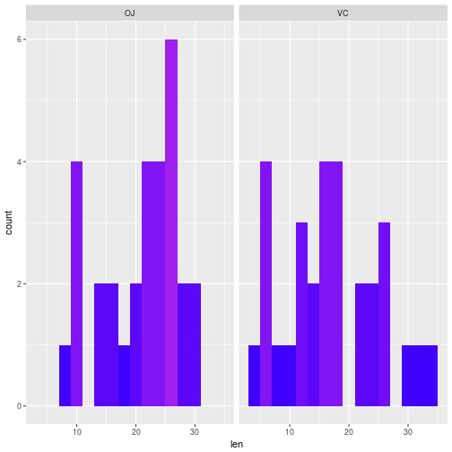
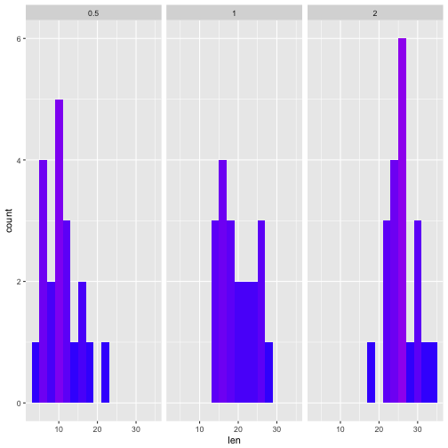
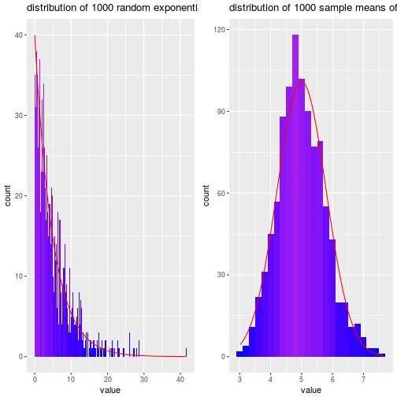

--- 
title "simulation and the Central limit theorem: statistical inference course project"
author: "Peter Thompson"
---
# Inference

## Synopsis
something about toothgrowth


### Data Summary

Note the R code used to obtain these results is included in the appendix.

There are 60 observations in the dataset. The length of guinea pig teeth (ondotoblasts) were measured after they had received some dose (either 0.5, 1.0, or 2.0 mg) of vitamen C, which was supplied either as orange juice (OJ) or an aqueous solution of ascorbic acid. (VC). Measurements were taken from 60 guinea pigs, such that each of the six dose/supplement combinations considered was administered to 10 animals. The mean and variance of the measured tooth length is listed below for each group.

 |supp | dose | meanlen | varlen |
 |-----|------|---------|--------|
 |  OJ |  0.5 |  13.23  |19.8890 | 
 |  OJ |  1.0 |  22.70  |15.2956 |
 |  OJ |  2.0 |  26.06  | 7.0493 |
 |  VC |  0.5 |   7.98  | 7.5440 |
 |  VC |  1.0 |  16.77  | 6.3268 |
 |  VC |  2.0 |  26.14  |23.0182 |

Initially, it seems that OJ has a larger effect on tooth length, with higher doses correlating with longer tooth lengths. The analysis below will consider these hypotheses and verify whether or not they are statistically significant.

## Analysis

### Supplement form
**check this for language** - we use "statistical significance" a lot. is there a better term for $\alpha$, or something?
In this section, the relationship between the supplement form (OJ vs VC) and tooth length will be analysed, neglecting dose.  Histograms of these groups are plotted in the appendix.

A two group (independent) t-test will be used, assuming unequal variance (or rather, not assuming equal variance) among groups. Note that the t-test assumes that the observations are normally distributed (although apparently it is 'robust' to this assumption). A paired t-test cannot be used, as we cannot relate observations from one group to those in another (group observations were made from unique animals).

In this case, the null hypothesis, $H_0$, is that the mean tooth length for each group is equal. Our alternate hypothesis, $H_a$ is that the means are *not* equal, and thus we will use a two sided t-test. A p-value will be considered significant if it is less than $\alpha = 0.05$,  that is, the null hypothesis will be rejected if there is less than a 5\% probability of it producing the observed data.

The t-test for supplement form has an associated t-statistic of 1.92, with a p-value of 0.06. For this result to be statistically significant at the 95\% level, we require a p-value less than 0.05. This is not the case, and so the null hypothesis is accepted, and we conclude that the supplement form (OJ vs VC) does not have a significant effect on tooth length.

### Dose Level
The relationship between vitamin C dose and toothe length will also be considered. There are three different dosages that were considered in the study. The tooth lengths for each of these dosages will be compared to those of the other two. As there are multiple hypotheses being compared, a bonferroni correction will be applied in order to limit the family wise error rate. While a p-value of $\alpha = 0.05$ was required for the supplement test, for the dosage tests the null hypothesis will only be rejected for p-values less than $\alpha_{fwer} = \alpha/2 = 0.025$, as each group of data is involved in two seperate hypothesis tests. As with the analysis of supplement form, a two group (independent) t-test with unequal variance is used to assess the significance.

A summary of the test results is included in the table below:

| group $A$ dose  (mg)| group $B$ dose (mg) | $\bar{X}_A $  ($\mu$m)| $\bar{X}_B$ ($\mu$m) | p-value |
|-----------------------|-----------------------|------------------|---------------|------------|
| 0.5 | 1.0 | 10.605  |  19.735 | 1.268e-07 |
| 0.5 | 2.0 | 10.605  |  26.100 | 4.398e-14 |
| 1.0 | 2.0 |19.735  |  26.100 | 1.906e-05 |

In all of the above cases, the p-value is less than 0.025, which is the threshold required for significance. For each of these three cases the null hypothesis is rejected in favour of the alternative, i.e. different dosage levels are associated with different tooth lengths. 

##Conclusions
Based on the analyses presented in this report, the following conclusions can be drawn:

- There is no significant difference in the measured tooth lengths for guinea pigs that received doses of abscorbic acid and guinea pigs that received doses of orange juice at the $\alpha = 0.05$ level
- There is a significant difference in the tooth lengths observed for guinea pigs that received 0.5 mg of vitamin C compared to those that received 1.0 mg of vitamin C at the $\alpha_{fwer} = 0.025$ level
- There is a significant difference in the tooth lengths observed for guinea pigs that received 0.5 mg of vitamin C compared to those that received 2.0 mg of vitamin C at the $\alpha_{fwer} = 0.025$ level
- There is a significant difference in the tooth lengths observed for guinea pigs that received 1.0 mg of vitamin C compared to those that received 2.0 mg of vitamin C at the $\alpha_{fwer} = 0.025$ level

### Assumptions
In conducting this analysis, the following assumptions were made:

- For a given dosage and supplement form, the tooth length observations are iid normal.
- For 

<!-- hypothesis tests:
OJ is better than VC
higher dose is better
growth per dose?

growth per dose,  (or oj >< VC, two sided)
dosage - test 0.5 vs 2.0, 0.5 vs 1.0, 1.0 vs 2.0
Dosage regardless of method
method regardless of dose
method - growth per unit dose

t distribution assumes data iid normal "but it is robust" to this
unequal variance (the variances above are not equal)
https://github.com/bcaffo/courses/blob/master/06_StatisticalInference/08_tCIs/index.pdf
^ slide 21

Can't use paired test, because we can't compute the differences (we have 60 seperate hamsters, not 10 that were fed vitamin c multiple times via different methods). independent group t intervals (unequal variance), with alternative that the difference is not equal to zero (mu2.0 - mu 0.5)

Go over math in first section/method

analysis section, make a bunch of tests -->


## Appendix

Summary of data - mean and variance of tooth length for each supplement/dose group


```r
library(dplyr)
```

```
## 
## Attaching package: 'dplyr'
```

```
## The following objects are masked from 'package:stats':
## 
##     filter, lag
```

```
## The following objects are masked from 'package:base':
## 
##     intersect, setdiff, setequal, union
```

```r
library(ggplot2)
head(ToothGrowth)
```

```
##    len supp dose
## 1  4.2   VC  0.5
## 2 11.5   VC  0.5
## 3  7.3   VC  0.5
## 4  5.8   VC  0.5
## 5  6.4   VC  0.5
## 6 10.0   VC  0.5
```

```r
ToothGrowth %>% group_by(supp,dose) %>% summarise(meanlen=mean(len),varlen=var(len))
```

```
## Source: local data frame [6 x 4]
## Groups: supp [?]
## 
##     supp  dose meanlen    varlen
##   <fctr> <dbl>   <dbl>     <dbl>
## 1     OJ   0.5   13.23 19.889000
## 2     OJ   1.0   22.70 15.295556
## 3     OJ   2.0   26.06  7.049333
## 4     VC   0.5    7.98  7.544000
## 5     VC   1.0   16.77  6.326778
## 6     VC   2.0   26.14 23.018222
```

t-test for supplement form


```r
vc <-ToothGrowth %>% filter(supp=='VC')
oj <-ToothGrowth %>% filter(supp=='OJ')
moose<-t.test(x=oj$len,y=vc$len,paired=F)
moose
```

```
## 
## 	Welch Two Sample t-test
## 
## data:  oj$len and vc$len
## t = 1.9153, df = 55.309, p-value = 0.06063
## alternative hypothesis: true difference in means is not equal to 0
## 95 percent confidence interval:
##  -0.1710156  7.5710156
## sample estimates:
## mean of x mean of y 
##  20.66333  16.96333
```

Histograms of tooth length for the different supplement forms


```r
ggplot(data=ToothGrowth,aes(x=len)) + geom_histogram(aes(fill=..count..),binwidth=2) + facet_grid( . ~supp) + scale_fill_gradientn(colours=c('blue','purple')) + guides(fill=F)
```


T-tests for the different dosage levels


```r
doses<-c(0.5,1.0,2.0)

for (i in 1:2)
{
    for (j in (i+1):3)
    {
        print(paste(doses[i],' vs ',doses[j]))
        groupa<- ToothGrowth %>% filter(dose ==doses[i])
        groupb<- ToothGrowth %>% filter(dose ==doses[j])
        test<-t.test(x=groupa$len,y=groupb$len,paired=F)
        print(test)

    }
}
```

```
## [1] "0.5  vs  1"
## 
## 	Welch Two Sample t-test
## 
## data:  groupa$len and groupb$len
## t = -6.4766, df = 37.986, p-value = 1.268e-07
## alternative hypothesis: true difference in means is not equal to 0
## 95 percent confidence interval:
##  -11.983781  -6.276219
## sample estimates:
## mean of x mean of y 
##    10.605    19.735 
## 
## [1] "0.5  vs  2"
## 
## 	Welch Two Sample t-test
## 
## data:  groupa$len and groupb$len
## t = -11.799, df = 36.883, p-value = 4.398e-14
## alternative hypothesis: true difference in means is not equal to 0
## 95 percent confidence interval:
##  -18.15617 -12.83383
## sample estimates:
## mean of x mean of y 
##    10.605    26.100 
## 
## [1] "1  vs  2"
## 
## 	Welch Two Sample t-test
## 
## data:  groupa$len and groupb$len
## t = -4.9005, df = 37.101, p-value = 1.906e-05
## alternative hypothesis: true difference in means is not equal to 0
## 95 percent confidence interval:
##  -8.996481 -3.733519
## sample estimates:
## mean of x mean of y 
##    19.735    26.100
```

Histograms of tooth length for the different dosage levels


```r
ggplot(data=ToothGrowth,aes(x=len)) + geom_histogram(aes(fill=..count..),binwidth=2) + facet_grid( . ~dose) + scale_fill_gradientn(colours=c('blue','purple')) + guides(fill=F)
```



<!--

```r
for (i in 1:3)
{
    ojdose<-ToothGrowth %>% filter(dose == doses[i] ) %>% filter(supp == 'OJ')
    vcdose<-ToothGrowth %>% filter(dose == doses[i] ) %>% filter(supp == 'VC')
    test<-t.test(x=ojdose$len,y=vcdose$len,paired=F)
        print(test)
}
```

```
## 
## 	Welch Two Sample t-test
## 
## data:  ojdose$len and vcdose$len
## t = 3.1697, df = 14.969, p-value = 0.006359
## alternative hypothesis: true difference in means is not equal to 0
## 95 percent confidence interval:
##  1.719057 8.780943
## sample estimates:
## mean of x mean of y 
##     13.23      7.98 
## 
## 
## 	Welch Two Sample t-test
## 
## data:  ojdose$len and vcdose$len
## t = 4.0328, df = 15.358, p-value = 0.001038
## alternative hypothesis: true difference in means is not equal to 0
## 95 percent confidence interval:
##  2.802148 9.057852
## sample estimates:
## mean of x mean of y 
##     22.70     16.77 
## 
## 
## 	Welch Two Sample t-test
## 
## data:  ojdose$len and vcdose$len
## t = -0.0461, df = 14.04, p-value = 0.9639
## alternative hypothesis: true difference in means is not equal to 0
## 95 percent confidence interval:
##  -3.79807  3.63807
## sample estimates:
## mean of x mean of y 
##     26.06     26.14
```


```r
ggplot(data=ToothGrowth,aes(x=len)) + geom_histogram(aes(fill=..count..),binwidth=2) + facet_grid( supp ~dose) + scale_fill_gradientn(colours=c('blue','purple'))+ guides(fill=F)
```


-->

